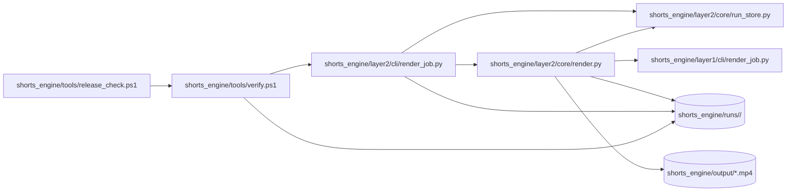
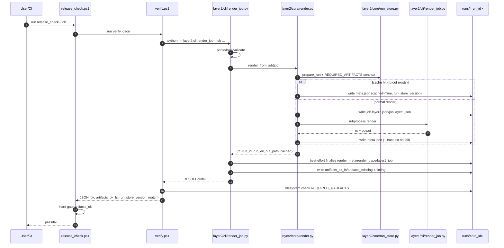

# Diagrams

## Component Diagram

## Sequence Diagram

## Evidence
- `shorts_engine/tools/release_check.ps1:L49-L114`
- `shorts_engine/tools/verify.ps1:L240-L347`
- `shorts_engine/layer2/cli/render_job.py:L131-L225`
- `shorts_engine/layer2/core/render.py:L64-L155`
- `shorts_engine/layer2/core/run_store.py:L11-L104`
- `shorts_engine/layer1/cli/render_job.py:L140-L178`
